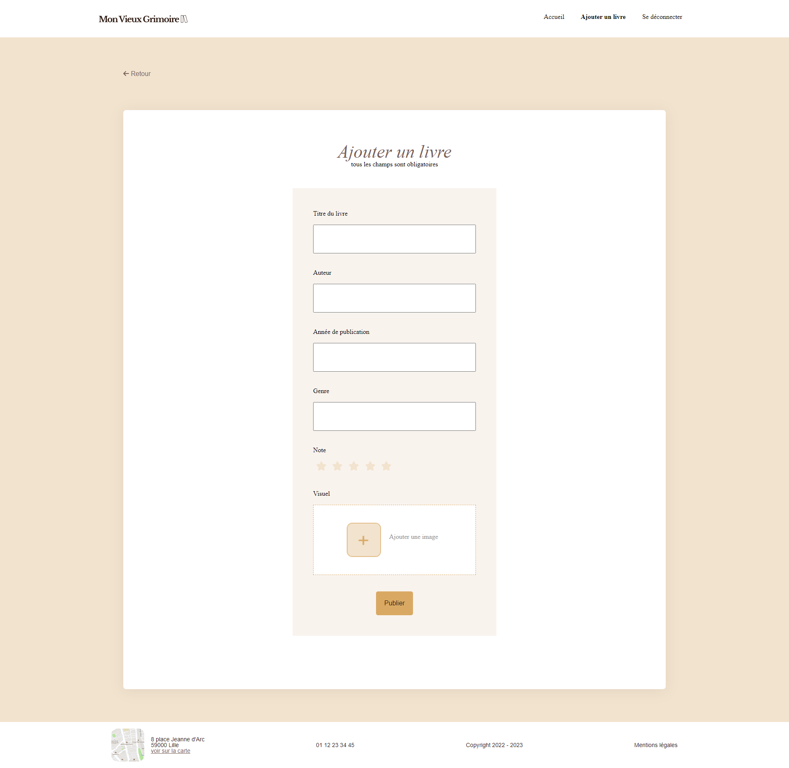

# Mon Vieux Grimoire - Site de notation de livres

## Description

Mon Vieux Grimoire est un site de référencement et de notation de livres. La mission consistait à développer le back-end du site en s'appuyant sur le front-end qui nous a été communiqué.

Front-end [disponible ici](https://github.com/OpenClassrooms-Student-Center/P7-Dev-Web-livres).

Le back-end de l'application utilise Node.js et comprend la création d'un serveur avec Express ainsi que l'utilisation de MongoDB pour la base de données.

Page d'accueil preview :


Ajouter un livre preview :


Page d'un livre preview :


## Fonctionnalités

- Création d'un serveur Express : mise en place d'un serveur Node.js avec Express et des premières routes.
- Création d'une API RESTful permettant de rendre l'application dynamique, pour les opérations CRUD sur les livres et les notations.
- Connexion à une base de données MongoDB : utilisation de Mongoose pour modéliser les données MongoDB et gestion des collections de livres et d'utilisateurs.
- Architecture MVC.
- Opérations CRUD (Créer, Lire, Mettre à jour et Supprimer) pour la gestion des livres et des notations.
- Système d'authentification sécurisé utilisant JWT (JSON Web Tokens) pour la gestion des sessions utilisateur.
- Gestion des images : téléchargement et optimisation des images de couverture des livres avec Sharp pour la conversion et la compression des images.
- Calcul de la note moyenne d'un livre en fonction des notations des utilisateurs.
- Sécurité des données.

## Installation

### Prérequis

- Node.js
- npm

### Étapes

1. Clonez le dépôt

```bash
git clone https://github.com/eleapmgt/Mon-Vieux-Grimoire-website.git
```

2. Accédez au dossier du projet

```bash
cd Mon-Vieux-Grimoire-website
```

3. Installez les dépendances

```bash
npm install
```

## Usage

Pour démarrer le serveur :

```bash
nodemon server
```
